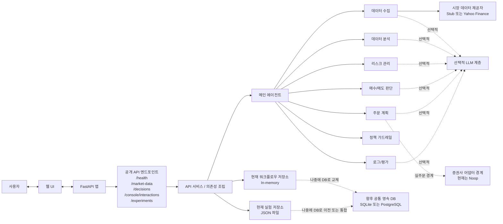

# Repository Flowchart

## 목적

이 문서는 현재 저장소의 멀티 에이전트 투자 워크플로우와 API 진입 경계를 간단한 Mermaid 차트로 보여준다.

## 현재 범위

* 사용자, 웹 UI, FastAPI, API 서비스/의존성 조립, 메인 에이전트 흐름을 포함한다.
* 현재 저장소 구현과 향후 공통 영속 DB 위치를 구분해서 표현한다.

## 관련 코드 경로

* `agent_pay_for_urself/api/app.py`
* `agent_pay_for_urself/api/dependencies.py`
* `agent_pay_for_urself/api/routes/`
* `agent_pay_for_urself/api/services/`
* `agent_pay_for_urself/orchestrator.py`
* `agent_pay_for_urself/agents/`
* `agent_pay_for_urself/adapters/`
* `agent_pay_for_urself/repositories/`
* `frontend/`

## Mermaid Chart

## 수정 트리거

* 공개 엔드포인트 묶음 구성이 크게 바뀔 때
* API 서비스 조립 방식이나 저장소 경계가 바뀔 때
* 에이전트 단계, 정책 가드레일, 외부 연동 경계가 바뀔 때
* 영속 DB가 실제 구현되어 현재 저장소 경계가 바뀔 때
