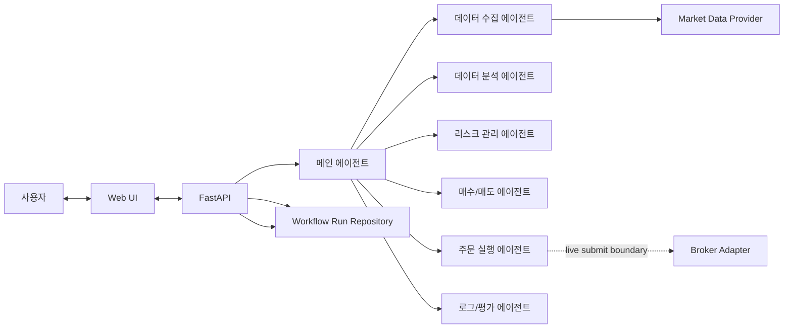

# Architecture

## Current Scope

* The current implementation is a minimum workflow skeleton.
* Real market data, live broker submission, and durable persistent storage are not wired yet.
* Broker-facing code and market-data access are introduced behind explicit adapter boundaries.
* Workflow results are currently stored only in an in-memory repository so console follow-up requests can resolve a prior run by `run_id`.

## Broker Direction

* Default broker target: `Korea Investment & Securities Open API`
* Default execution market: US equities via overseas stock trading
* Broker integration should be isolated behind an adapter interface so the orchestrator and agents stay broker-agnostic.

## Minimum Agent Flow

## API Layout

* `agent_pay_for_urself/api/main.py` only exposes the ASGI entrypoint.
* `agent_pay_for_urself/api/app.py` creates the FastAPI application and registers routers.
* `agent_pay_for_urself/api/routes/` contains HTTP endpoints.
* `agent_pay_for_urself/api/models/` contains public Pydantic request and response models.
* `agent_pay_for_urself/api/mappers/` converts internal workflow dataclasses into API responses.
* `agent_pay_for_urself/api/services/` contains API-facing workflow and console assistant logic.
* `/console/interactions` is the primary console-assistant endpoint.
* `/agent/interactions` remains as a deprecated compatibility alias.

## Implementation Notes

* `MainAgent` is the only component that coordinates other agents.
* The current workflow order is collection -> analysis -> risk assessment -> buy/sell decision -> order planning -> evaluation.
* Agent outputs use structured dataclasses in `agent_pay_for_urself.schemas`.
* `DataCollectionAgent` now depends on a `MarketDataProvider` boundary and the default implementation is `StubMarketDataProvider`.
* `OrderExecutionAgent` currently creates order plans only; live broker submission is split behind `BrokerAdapter` and the default implementation is `NoopBrokerAdapter`.
* `DecisionWorkflowService` stores `WorkflowResult` values in `InMemoryWorkflowRunRepository` and returns a `run_id` to the API caller.
* Real data providers, durable repositories, and broker adapters should be added behind these explicit interfaces.
* The first broker adapter should target `Korea Investment & Securities Open API`.
* The first live execution scope should cover overseas stock order submission, order status checks, and execution result collection.

## Future Integration Template

### Data Provider Adapter

* Status: `Stub implemented`
* Runtime source: `StubMarketDataProvider`
* Live provider contract: `TBD`

### Broker Adapter

* Status: `Planned with noop boundary`
* First target: `Korea Investment & Securities Open API`
* Submit order contract: `BrokerAdapter.submit_order`
* Order status contract: `BrokerAdapter.get_order_status`

### Persistence Layer

* Status: `In-memory only`
* Durable storage contract: `TBD`
