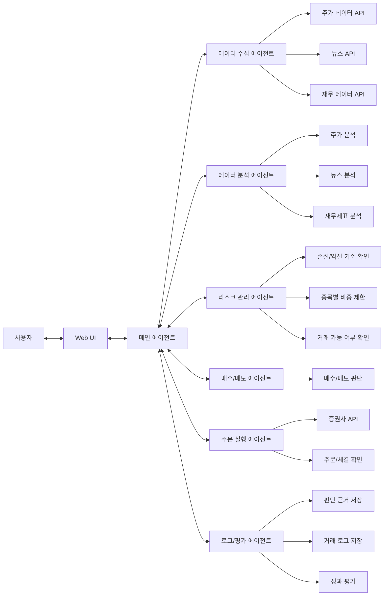

# Architecture

## Current Scope

* The current implementation is a minimum workflow skeleton.
* Real market data, broker submission, and persistent storage are not wired yet.
* Broker-facing code should be introduced behind explicit adapter or repository boundaries.

## Broker Direction

* Default broker target: `Korea Investment & Securities Open API`
* Default execution market: US equities via overseas stock trading
* Broker integration should be isolated behind an adapter interface so the orchestrator and agents stay broker-agnostic.

## Minimum Agent Flow

## Implementation Notes

* `MainAgent` is the only component that coordinates other agents.
* The current workflow order is collection -> analysis -> risk assessment -> buy/sell decision -> order planning -> evaluation.
* Agent outputs use structured dataclasses in `agent_pay_for_urself.schemas`.
* `OrderExecutionAgent` currently creates order plans only; it does not call a broker.
* Real data providers and broker adapters should be added behind explicit interfaces.
* The first broker adapter should target `Korea Investment & Securities Open API`.
* The first live execution scope should cover overseas stock order submission, order status checks, and execution result collection.

## Future Integration Template

### Data Provider Adapter

* Status: `TBD`
* Input contract: `TBD`
* Output contract: `TBD`

### Broker Adapter

* Status: `Planned`
* First target: `Korea Investment & Securities Open API`
* Submit order contract: `TBD`
* Order status contract: `TBD`

### Persistence Layer

* Status: `TBD`
* Storage contract: `TBD`
