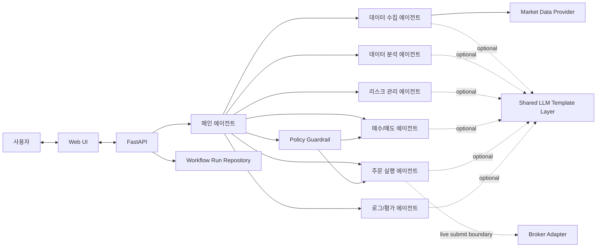

# Architecture

## Current Scope

* The current implementation is a minimum workflow skeleton.
* Live market data can now be enabled through a Yahoo Finance provider, and a Korea Investment mock broker adapter can be configured for overseas paper-trading submission while durable persistent storage remains unwired.
* Workflow results are currently stored only in an in-memory repository so console follow-up requests can resolve a prior run by `run_id`.
* Each workflow agent can optionally route through a shared LLM template layer backed by OpenAI Responses API, and the runtime can assign a different model per agent.
* `MainAgent` owns the user mandate for each run and enforces it through `PolicyGuardrail`.
* The FastAPI layer emits minimal INFO-level console logs for request start/completion, and workflow/order services log completion summaries with `run_id`.
* If `OPENAI_API_KEY` is not configured, the workflow falls back to deterministic in-process logic and does not call an external LLM.

## Broker Direction

* Default broker target: `Korea Investment & Securities Open API`
* Default execution market: US equities via overseas stock trading
* Broker integration should be isolated behind an adapter interface so the orchestrator and agents stay broker-agnostic.

## Minimum Agent Flow

## API Layout

* `agent_pay_for_urself/api/main.py` only exposes the ASGI entrypoint.
* `agent_pay_for_urself/api/app.py` creates the FastAPI application and registers routers.
* `agent_pay_for_urself/api/routes/` contains HTTP endpoints.
* `agent_pay_for_urself/api/models/` contains public Pydantic request and response models, including optional mandate input and mandate violation output.
* `agent_pay_for_urself/api/mappers/` converts internal workflow dataclasses into API responses.
* `agent_pay_for_urself/api/services/` contains API-facing workflow and console assistant logic.
* `/console/interactions` is the primary console-assistant endpoint.
* `/experiments` runs and stores Web UI experiment-lab requests with experiment metadata, decision input, prompt overrides, runtime summary, and workflow result.
* `/agent/interactions` remains as a deprecated compatibility alias.
* The frontend is built as a static export for Cloudflare Pages. Local development keeps the `/api/:path*` rewrite, while production requests use the build-time `NEXT_PUBLIC_API_BASE_URL` value.

## Implementation Notes

* `MainAgent` is the only component that coordinates other agents.
* The current runtime is still a sequential Python orchestrator. `langgraph` is installed as a dependency, but the workflow has not yet been migrated to a compiled LangGraph runtime.
* The current workflow order is collection -> analysis -> risk assessment -> buy/sell decision -> order planning -> evaluation.
* Agent outputs use structured dataclasses in `agent_pay_for_urself.schemas`.
* `InvestmentMandate` captures the user-owned operating boundary for a run.
* `PolicyGuardrail` clamps decisions and order plans that violate allowed or excluded symbols before evaluation logging.
* `agent_pay_for_urself/llm/` contains the shared OpenAI client, JSON payload helpers, schema parsing helpers, and the per-agent model routing table used by LLM-enabled agents.
* `DataCollectionAgent` depends on a `MarketDataProvider` boundary; `StubMarketDataProvider` remains the deterministic default and `YahooFinanceMarketDataProvider` can be selected with `MARKET_DATA_PROVIDER=yahoo`.
* `OrderExecutionAgent` currently creates order plans only; explicit live broker submission is exposed through the `orders` API routes and the shared `BrokerAdapter` boundary. The default implementation is `NoopBrokerAdapter`, and `KisMockBrokerAdapter` can be configured for paper trading.
* `DecisionWorkflowService` stores `WorkflowResult` values in `InMemoryWorkflowRunRepository`, returns a `run_id` to the API caller, and reports runtime mode metadata for decision responses.
* `ExperimentService` runs the same orchestrator with optional `AgentPromptOverrides`, stores the run in the in-memory workflow repository, and persists the public experiment payload in `JsonFileExperimentRepository`.
* Real data providers, durable repositories, and broker adapters should be added behind these explicit interfaces.
* The first broker adapter should target `Korea Investment & Securities Open API`.
* The first live execution scope should cover overseas stock order submission, order status checks, and execution result collection.

## Future Integration Template

### Data Provider Adapter

* Status: `Stub and Yahoo Finance implemented`
* Runtime source: `StubMarketDataProvider` or `YahooFinanceMarketDataProvider`
* Live provider contract: `MarketDataProvider.get_market_data`

### Broker Adapter

* Status: `Noop and KIS mock adapter implemented`
* First target: `Korea Investment & Securities Open API`
* Runtime selection: `BROKER_ADAPTER=noop` or `BROKER_ADAPTER=kis_mock`
* Submit order contract: `BrokerAdapter.submit_order`
* Order status contract: `BrokerAdapter.get_order_status`

### Persistence Layer

* Status: `In-memory workflow runs plus local JSON experiment history`
* Workflow run repository: `InMemoryWorkflowRunRepository`
* Experiment history repository: `JsonFileExperimentRepository` storing `data/experiments.json` by default
* Durable multi-user storage contract: `TBD`

### Agent LLM Prompt Layer

* Status: `Shared template implemented with experiment prompt overrides`
* Runtime source: `OpenAIResponsesClient` or `NoopAgentLLMClient`
* Default model: `gpt-5.5`
* Per-agent model contract: `OPENAI_DATA_COLLECTION_MODEL`, `OPENAI_DATA_ANALYSIS_MODEL`, `OPENAI_RISK_MANAGEMENT_MODEL`, `OPENAI_BUY_SELL_MODEL`, `OPENAI_ORDER_EXECUTION_MODEL`, and `OPENAI_LOG_EVALUATION_MODEL` can override the default model per agent
* Per-agent prompt contract: Web experiment overrides are appended as run-specific guidance and cannot replace the schema-preserving base instruction.

### Policy Guardrail

* Status: `Mandate boundary implemented`
* Runtime source: `PolicyGuardrail`
* Current hard checks: `allowed_symbols`, `excluded_symbols`
* Future policy checks: `TBD`
