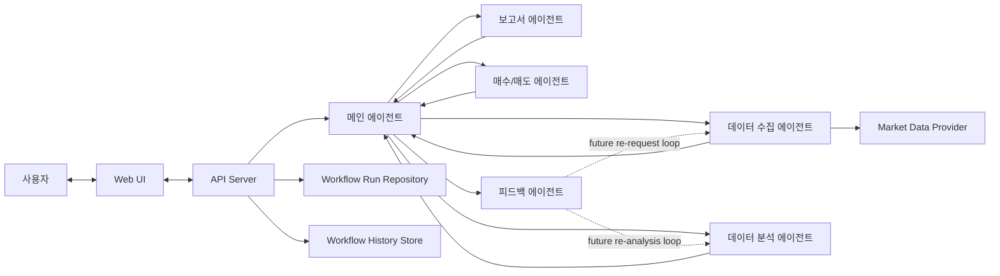

# Architecture

## Current Scope

* 현재 저장소는 멀티 에이전트 투자 워크플로우의 최소 동작 버전을 가진다.
* 백엔드는 `artifacts/api-server`, 프론트는 `artifacts/agent-pay-for-urself`에 있다.
* 실행 결과는 메모리 기반 run 저장소와 로컬 JSON 히스토리에 저장된다.
* 현재 런타임은 TypeScript 기반 내부 `StateGraph` 컴파일드 그래프다.

## Current Agent Flow

## Current Implementation Notes

* 오케스트레이터: `artifacts/api-server/src/engine/orchestrator.ts`
* 단계 로직: `artifacts/api-server/src/engine/agents.ts`
* 프롬프트 계약: `artifacts/api-server/src/lib/agent-prompts-store.ts`
* 히스토리 타임라인: `artifacts/api-server/src/routes/history.ts`
* 프론트 타입/정규화: `artifacts/agent-pay-for-urself/src/lib/workspace.ts`

현재 워크플로우 순서는 아래와 같다.

1. 메인 에이전트가 `SupervisorDirective`를 만든다.
2. 데이터 수집 에이전트가 `MarketData[]`를 만든다.
3. 데이터 분석 에이전트가 `AnalysisSignal[]`를 만든다.
4. 보고서 에이전트가 `InvestmentReport[]`를 만든다.
5. 매수/매도 에이전트가 `TradeDecision[]`를 만든다.
6. 피드백 에이전트가 `WorkflowFeedback`을 만든다.

## Current Graph Runtime

현재 그래프 런타임은 `artifacts/api-server/src/engine/state-graph.ts` 와 `artifacts/api-server/src/engine/workflow-graph.ts` 에 있다.

이미 하고 있는 일은 다음과 같다.

* 메인 에이전트를 라우터 노드로 사용
* 각 서브 에이전트 실행 후 다시 메인 에이전트로 복귀
* 피드백 결과에 따라 데이터 수집 또는 데이터 분석으로 재진입
* 최대 재시도 횟수로 루프 종료

아직 하지 않는 일은 다음과 같다.

* 외부 `@langchain/langgraph` 패키지 사용
* checkpoint persistence
* streaming / interrupt / resumable execution

## Persistence

* 현재 workflow run 저장소: in-memory
* 현재 workflow history 저장소: local JSON
* 실험/보고서 화면은 저장된 public payload를 재사용한다.

## Future LangGraph Migration Target

LangGraph로 옮길 때의 목표는 아래다.

* 외부 LangGraph 패키지로 동일 그래프를 교체
* checkpoint와 durable state를 추가
* streaming/visualization/debug tooling을 붙인다
