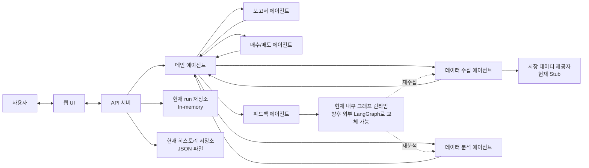

# Repository Flowchart

## 목적

이 문서는 현재 저장소의 멀티 에이전트 투자 워크플로우와 주요 코드 경계를 새 에이전트 구조 기준으로 보여준다.

## 현재 범위

* 사용자, 웹 UI, API 서버, 메인 에이전트 흐름을 포함한다.
* 현재 구현된 내부 그래프 런타임과 향후 외부 LangGraph 교체 지점을 구분해서 표현한다.

## 관련 코드 경로

* `artifacts/api-server/src/routes/`
* `artifacts/api-server/src/engine/orchestrator.ts`
* `artifacts/api-server/src/engine/agents.ts`
* `artifacts/api-server/src/engine/market-data.ts`
* `artifacts/api-server/src/lib/agent-prompts-store.ts`
* `artifacts/api-server/src/lib/history-store.ts`
* `artifacts/agent-pay-for-urself/src/components/`
* `artifacts/agent-pay-for-urself/src/lib/workspace.ts`

## Mermaid Chart

## 수정 트리거

* 에이전트 단계 이름이나 순서가 바뀔 때
* 피드백 루프가 실제 LangGraph로 구현될 때
* 저장소 경계나 API 진입 구성이 바뀔 때
